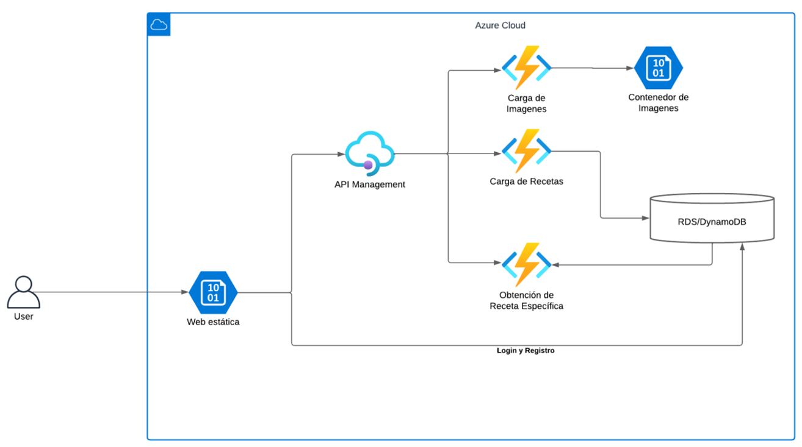

# GRUPO 19 - SEMINARIO DE SISTEMAS I

## Práctica 2 - SaborConecta

## 1. Integrantes del grupo 

| # | Nombre                                 | Carnet     |
|---|----------------------------------------|------------|
| 1 | Bismarck Estuardo Romero Lemus         | 201708880  |
| 2 | Naomi Rashel Yos Cujcuj                | 202001814  |
| 3 | Pedro Alejandro Zetino Páez            | 202004750  |
| 4 | Jonathan Josué Argueta Salazar         | 201700568  |
| 5 | Josué Nabí Hurtarte Pinto              | 202202481  |

## 2. Descripción del proyecto y arquitectura Usada

SaborConecta es una plataforma web que permite a los usuarios gestionar, compartir y descubrir recetas de cocina en la nube. El sistema facilita la creación de perfiles, la subida de imágenes, la organización de recetas por categorías y la interacción social mediante favoritos. Está diseñado para ser escalable y seguro, integrando servicios cloud y una base de datos relacional para almacenar la información de usuarios y recetas.

### Vista de home

### Vista de recetas

### Vista de recetas por categoría

### Vista de receta individual

### Vista de mis recetas

### Vista de crear receta

### Vista recetas favoritas

### Vista de perfil

### Arquitectura en la nube

### Base de datos

## 3. Capturas de pantalla de los recursos

### 3.1 Base de datos

### 3.2 Blob Containers

### 3.3 Instancias de VM

### 3.4 Load Balancer

### 3.5 Functions

### 3.6 API Management

## 4. Comparativa de proveedores de servicios en la nube

Al hacer una comparación entre los servicios de AWS y Azure, se nota una mayor complejidad en el lado de azure, siendo que este proveedor de servicios no es tan amigable con un nuevo usuario como AWS. 
Una de las mayores ventajasde Azure, es su fácil integración con los servicios de Microsoft.